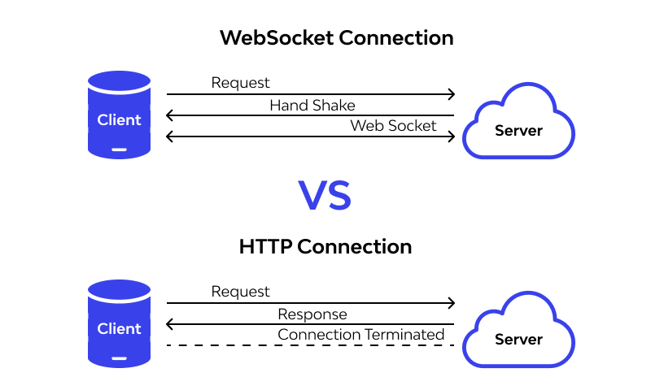

# Real-Time Communication in Web Applications with SocketIO

## Introduction

Up to this point, we have been building a web application with HTTP protocol. This protocol is a request-response protocol. The client sends a request to the server and the server responds to the request and the connection is closed.

Once the HTTP connection is closed, the server cannot send any data to the client. and the client can't send any data to the server.

But what if we wanted to keep the connection open and keep sending messages/data between the client and the server? This is where Socket.IO comes in.

Socket.IO is a library that enables real-time, bidirectional and event-based communication between the browser and the server.

## Sockets Vs HTTP



## How to setup socket io

### Backend / Server

1. initialize a `pnpm` project

```bash
pnpm init
```

2. install `express` and `socket.io`

```bash
pnpm i express socket.io
```

3. create a `server.js` file

```js
import express from "express";
import { createServer } from "http";
import { Server } from "socket.io";

const app = express();
const httpServer = createServer(app);
const io = new Server(httpServer, { /* options */ });

io.on("connection", (socket) => {
  console.log("a user connected");

    socket.on("disconnect", () => {
        console.log("user disconnected");
    });

    socket.on("my_event", (msg) => {
        console.log("my_event: " + msg);
    });
});

httpServer.listen(3000);
```

4. run the server

```bash
node server.js
```

5. Open posteman
6. Click on `New` > `Socket.IO`
7. Enter your localhost server URL `http://localhost:3000`
8. Click on `Connect`
9. you can now see the logs in the terminal
10. send `my_event` event with a message
11. you can now see the logs in the terminal

Event names in socket io are similar to your traditional HTTP urls, they can be any string you want. this will help you identify the event and handle it accordingly.

### Frontend / Client

1. initialize a new react project
    
```bash
pnpm create vite@latest
```
2. install `socket.io-client`

```bash
pnpm i socket.io-client
```

3. cleanup your initial vite project by removing the styles and the filler stuff

4. in `App.jsx` outside the `App` component create a new socket instance

```js
import { io } from "socket.io-client";

const socket = io("http://localhost:3000");
```

**Note:** We create the socket instance outside the component so that we don't create a new socket instance every time the component re-renders, we only need one socket instance, and we can always export it and import it into any component we want.

5. in `App.jsx` inside the `App` component add a button that sends a message to the server

```jsx
<button onClick={() => socket.emit("my_event", "hello from client")}>
  Send Message
</button>
```

6. Make sure your backend server is running
7. Click on the button and you will see the message in the terminal
8. Now we want to display the message in the browser, to do that we need to listen to the `my_event` event in the client

```jsx
import { io } from "socket.io-client";

const socket = io("http://localhost:3000");

const App = () => {
  const [message, setMessage] = useState("");

  useEffect(() => {
    const handler = (msg) => {
      setMessage(msg);
    };
    socket.on("my_event", handler);
    return () => {
        // cleanup
      socket.off("my_event", handler);
    };
  }, []);

  return (
    <div>
      <h1>{message}</h1>
      <button onClick={() => socket.emit("my_event", "hello from client")}>
        Send Message
      </button>
    </div>
  );
};
```

9. Now when you click on the button you will see the message in the browser

10. Now if we want to send a custom message lets add an input field

```jsx
import { io } from "socket.io-client";

const socket = io("http://localhost:3000");

const App = () => {
  const [message, setMessage] = useState("");
  const [input, setInput] = useState("");

  useEffect(() => {
    const handler = (msg) => {
      setMessage(msg);
    };
    socket.on("my_event", handler);
    return () => {
      socket.off("my_event", handler);
    };
  }, []);

  return (
    <div>
      <h1>{message}</h1>
      <input
        type="text"
        value={input}
        onChange={(e) => setInput(e.target.value)}
      />
      <button onClick={() => socket.emit("my_event", input)}>Send Message</button>
    </div>
  );
};
```

**Challenge**

Make a chat app using Socket io
